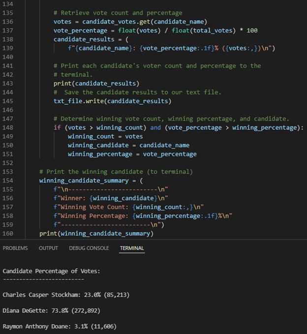

# Election Analysis

## Analysis of the Election Audit
## 1. Overview of Election Audit:

In this project, members of the Colorado Board of Elections is seeking our help to complete their election audit for a local congressional race. We are tasked to create a Python script that will provide the following information when the script is run:

* Total number of votes cast
* A complete list of candidates who received votes
* Total number of votes each candidate received
* Percentage of votes each candidate won
* The winner of the election based on popular vote

## 2. Election-Audit Results:

### A. How many votes were cast in this congressional election?

> - **Total Votes Cast** in this congressional election was **369,711** 

Code Used:

 

### B. Provide a breakdown of the number of votes and the percentage of total votes for each county in the precinct.
> ***County Votes:***
> - **Jefferson** county has `10.5%` total percentage with a total votes of **38,855**
> - **Denver** county has the `82.8%` total percentage with a total votes of **306,055**
> - **Arapahoe** county has `6.7%` total percentage with a total votes of **24,801**

Code Used:

### C. Which county had the largest number of votes?
> ***County with Largest Number of Votes:***
> - **Denver** county has the largest number total of **306,055**
> - **Denver** county has the total votes percentage of `82.8%`  

Code Used:

### D. Provide a breakdown of the number of votes and the percentage of the total votes each candidate received.
> ***Candidate Percentage of Votes:***
> - **Charles Casper Stockham** candidate has `23.0%` total percentage with a total votes of **85,213**
> - **Diana DeGette** candidate has the `73.8` total percentage with a total votes of **272,892**
> - **Raymon Anthony Doane** candidate has `3.1%` total percentage with a total votes of **11,606**

Code Used:

### E. Which candidate won the election, what was their vote count, and what was their percentage of the total votes?
> ***Election Results:***
> - **Diana DeGette** won the election, with a total vote count of **272,892**
> - **Diana DeGette** has the total percentage votes of `73.8%`  

Code Used:

## 3. Election-Audit Summary:

In addition to this analysis, I would also propose to the Colorado Board of Elections to utitilze this code in other future election audits. This code is very versitile in its capabilities to conduct thorough and percise calculations for nearly any election with the proper modifications. One such modification could come in the form of changing the scope of the election, for instance, if this was a referendum vote instead of an elected officials vote. Instead of having a list of candidates as the main determining factor for a winner, the determining factor would be a range of ideas to see which idea is post popular in certain regions or counties. To go along with this referendum idea, another modifications that could be to change the geographical data to congressional districts so that representatives of their specific regions could see which ideas are most popular in their district as opposed to county, or state-wide.  